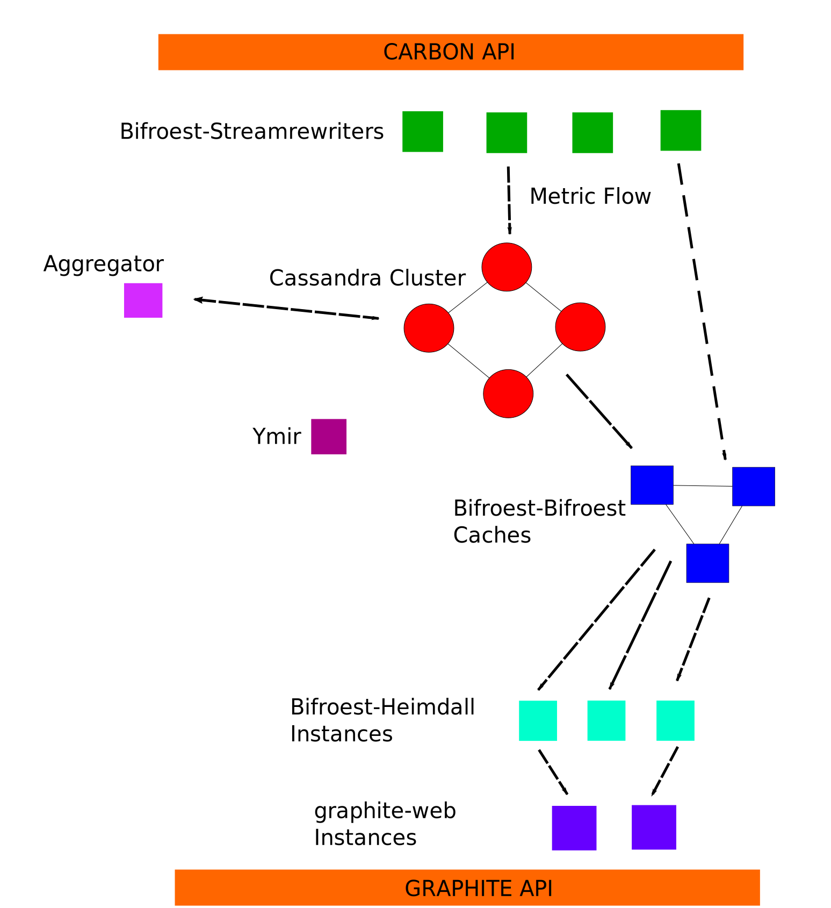

# Bifroest Highlevel Overview

## Critical Data Path

The critical data path is the path from the `Carbon API endpoint` to the
database. It is critical, because if we lose metrics here, they're gone
for good and nothing can help us here.

Thus this data path is short and redundant: First, we have a [Apache Cassandra cluster](http://cassandra.apache.org/), 
which is highly available and fault-tolerant. This cassandra cluster is fed by the
`bifroest-stream-rewriter`. In our test configuration, the stream-rewriter opens port 9003
and accepts metrics in the `carbon plain text protocol`. The pickle protocol is not
supported at the moment (Nov 2015). It is possible and recommended
to run multiple stream rewriters for redundancy.

### Bifroest-Streamrewriter

The stream rewriter opens port 9003 usually, and accepts data in the carbon plaintext
protocol only. Metrics accepted are first written to the cassandra database according
to the current retention configuration. If this write is successful, then data is 
also sent to the bifroest caches for faster access. 

Note that this structure makes it safe to shutdown bifroest, because all data is still
written to the database even if the stream rewriter is unable to contact bifroest.

If the stream rewriter has trouble forwarding data to the database,
it will eventually close the carbon plaintext port until it can output the data again.

## Data Path to Graphite

The data path to graphite looks very much like a tiered web application:

 - We have our cassandra database in the back, which has all data. However, this
   database is relatively slow when reading from it.
 - Thus, we have the bifroest-bifroest cluster, which caches both the metric
   tree as well as the values of recently requested metrics. For performance
   reasons, the metric cache is directly fed by the stream rewriter to minimize
   database accesses for cached values.
 - Finally, we have bifroest-heimdall. bifroest-heimdall offers a simple interface
   for graphite-web to access the metrics cached in bifroest-bifroest.

After this, we're speaking graphite-render-API and all possible tools are available
for use.

### Bifroest-Bifroest Caches

The bifroest-bifroest cache seen as the entire cluster has two jobs:

 - Keep the overall tree of metric names around, in order to allow fast evaluation of
   queries like "servers.\*".
 - Keep the most recenlty requested metric values around for faster response times in
   graphite.

Internally, the application is an active cluster, similar to e.g ElasticSearch. That means,
adding more nodes will trigger a cluster rebalance, database reloads and a general cache
increase. Individually, each node is responsible for a small subset of all metric names.

### Bifroest-Heimdall

Bifroest-Heimdall is the gateway to the bifroest-bifroest cache cluster.  Heimdall
has the job of encapsulating the question "Well which bifroest instance do I have to
ask for a specific metric?". 

Heimdall consists of a number of independent instances just like the stream rewriter.

### Graphite-web

This is graphite-web as you know it, including pull request #698 and with the bifroest-bindings
in graphite web. This allows graphite to communicate with one of the heimdall instances.
After this, we're speaking plain graphite-render API.

## Other stuff

### Aggregator

The aggregator is responsible for maintaining retention levels, deleting metric values
and keeping the database from overflowing. It periodically replaces e.g. data at a 
1 datapoint per minute resolution with data at a 1 datapoint per hour resolution.

The aggregator is not part of either critical data flow, so it can be shutdown without
impact to the customers. Just be aware that this will cause your disk usage to increase
sharply across the cluster. Additionally, the cleanup after a certain downtime
can be very heavy on the database.

### Ymir

Ymir is a simple small performance optimization. Ymir pre-creates database tables as
necessary so once a table is necessary, it was already created and the stream rewriter
can just write to it. This is necessary, because creating table causes all other cassandra
operations to become synchronized.
